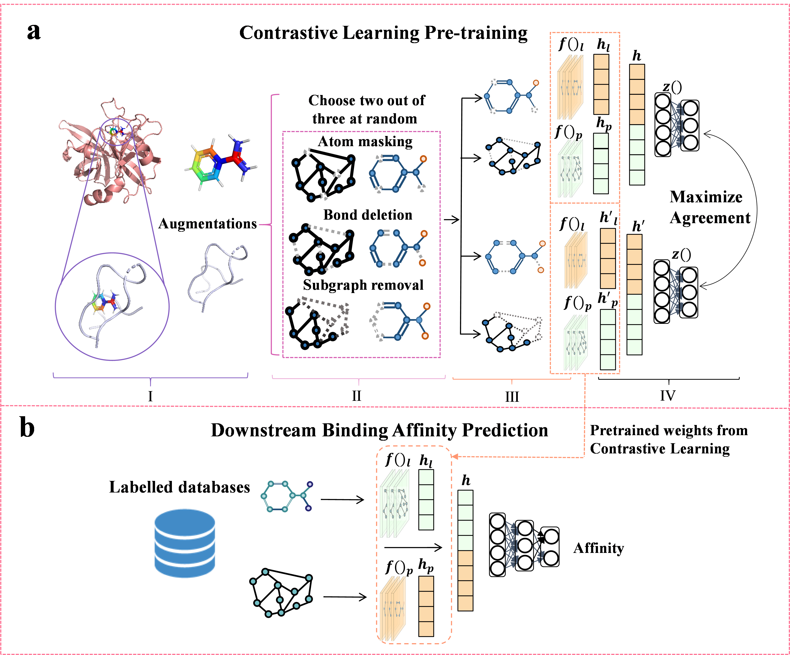

## CL-GNN: Contrastive Learning and Graph Neural Network for Protein-Ligand Binding Affinity Prediction ##





## Getting Started

### Installation

Set up conda environment and clone the github repo

```
$ pip install -r requirements.txt
```

### Dataset

The data for CASF 2016 and CASF 2013 can be found in `data`

### Pre-training

To train the CL-GNN, where the configurations and detailed explaination for each variable can be found in `options.py`
```
$ python train.py
```

### Fine-tuning 

To fine-tune the CL-GNN pre-trained model on downstream molecular benchmarks.
```
$ python Downstream_test/train.py
```

### Pre-trained  and Downstream models

We also provide pre-trained and Downstream models, which can be found in `pth` respectively. 

### Model evaluation

Model evaluation in `Model evalution.ipynb`
